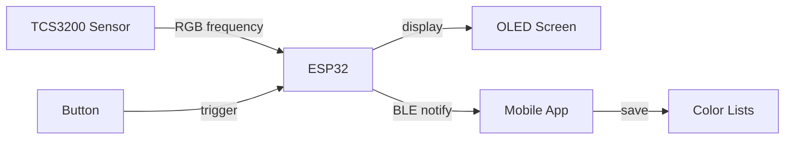

# Surface Color Detector

> Detect any surface color with an ESP32, display it on OLED, and sync to your phone via Bluetooth.

This project combines hardware and software to create a portable color detection tool. Hold the sensor against any surface, press the button to sample, and get accurate RGB values with automatic color naming.

---

## Demo

```
[Short press]  →  Take sample (repeat for accuracy)
[Long press]   →  Finalize & send to phone
[Press again]  →  Reset for new measurement
```

The device averages multiple samples (minimum 3) before determining the final color, which improves accuracy on uneven or textured surfaces.

---

## How It Works



**Flow:**
1. User presses button → sensor reads surface color
2. ESP32 converts frequency to RGB values
3. Result displayed on OLED + sent via Bluetooth
4. Mobile app receives and displays color, can save to lists

---

## Repository Structure

| Folder | Description | Docs |
|--------|-------------|------|
| [`mcu/`](./mcu) | ESP32 firmware written in C++ using PlatformIO | [→ mcu/README.md](./mcu/README.md) |
| [`mobile/`](./mobile) | React Native app built with Expo | [→ mobile/README.md](./mobile/README.md) |
| [`report/`](./report) | Wiring diagram and wiring guide | [→ report/README.md](./report/README.MD) |

---

## Hardware

| Component | Purpose |
|-----------|---------|
| ESP32 DevKit | Microcontroller with BLE |
| TCS3200 | RGB color sensor (frequency output) |
| 0.91" SSD1306 | 128x32 OLED display (I2C) |
| Push button | Trigger sampling |

**Wiring summary:**

| TCS3200 | ESP32 | | OLED | ESP32 | | Button | ESP32 |
|---------|-------|-|------|-------|-|--------|-------|
| S0 | 33 | | SDA | 21 | | Signal | 13 |
| S1 | 32 | | SCL | 22 | | | |
| S2 | 27 | | | | | | |
| S3 | 25 | | | | | | |
| OUT | 35 | | | | | | |
| LED | 26 | | | | | | |

Full wiring diagram with images: [`report/`](./report)

---

## Getting Started

### 1. Flash the firmware

```bash
cd mcu
pio run --target upload
pio device monitor   # verify with serial output
```

### 2. Run the mobile app

```bash
cd mobile
npm install
npx expo run:ios     # or: npx expo run:android
```

**Note:** BLE requires a physical device. Simulators don't support Bluetooth, but the app has a mock mode for UI testing.

---

## Color Detection

The sensor can identify and name these colors:

| | | |
|---|---|---|
| Black | Red | Cyan |
| White | Green | Magenta |
| Dark Gray | Blue | Purple |
| Gray | Yellow | Pink |
| Light Gray | Orange | Brown |

Detection uses threshold-based analysis on RGB values. See [`mcu/src/color_sensor.cpp`](./mcu/src/color_sensor.cpp) for the algorithm.

---

## BLE Protocol

| Property | Value |
|----------|-------|
| Device Name | `Surface Color Detector` |
| Service UUID | `4fafc201-1fb5-459e-8fcc-c5c9c331914b` |
| Characteristic UUID | `beb5483e-36e1-4688-b7f5-ea07361b26a8` |
| Data Format | `R,G,B,ColorName` (e.g., `255,128,64,ORANGE`) |

The characteristic supports READ, WRITE, NOTIFY, and INDICATE. Color data is pushed via NOTIFY when sampling completes.

---

## Configuration

Both sampling behavior and color calibration can be adjusted:

**Sampling (in `mcu/src/sampling_controller.cpp`):**
```cpp
controller.setLongPressDuration(2000);  // ms to hold for finalize
controller.setMinSamplesRequired(3);    // samples before allowing finalize
```

**Color calibration (in `mcu/src/color_sensor.cpp`):**
```cpp
// Adjust these ranges based on your lighting conditions
color.red = constrain(map(redFreq, 26, 155, 255, 0), 0, 255);
```

Enable `#define DEBUG_SENSOR` to see raw frequency values in serial monitor.

---

## License

MIT
